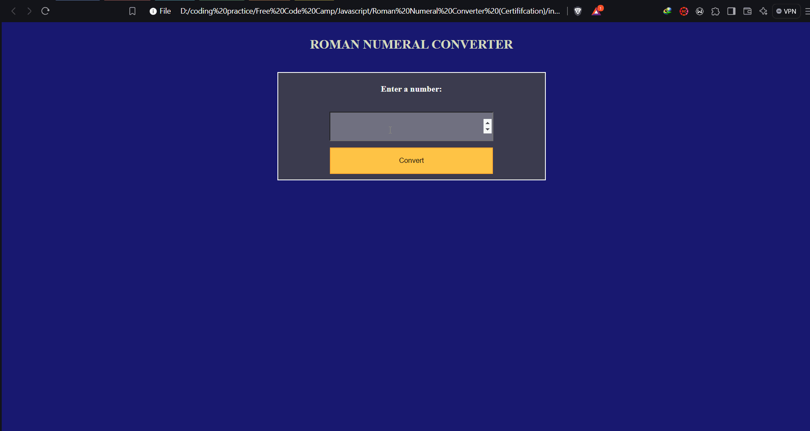

**Roman Numeral Converter**

This program converts numbers from 1 to 3999 into Roman numerals, providing an intuitive user interface for input and validation. It ensures users can only input valid numbers within the specified range.

Key features:

Input: Users can enter a number between 1 and 3999 to convert it into its Roman numeral equivalent.
Validation: The program includes validation to prevent inputs of numbers less than 1 or greater than 3999, ensuring accurate conversions.

